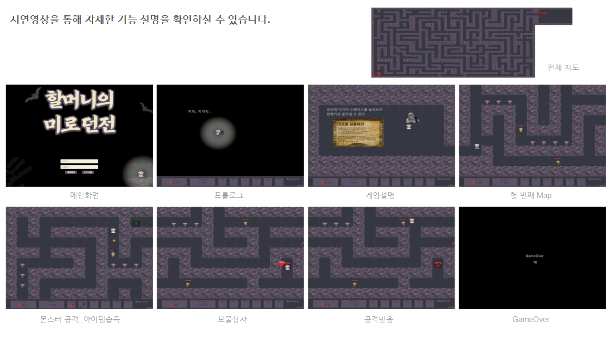
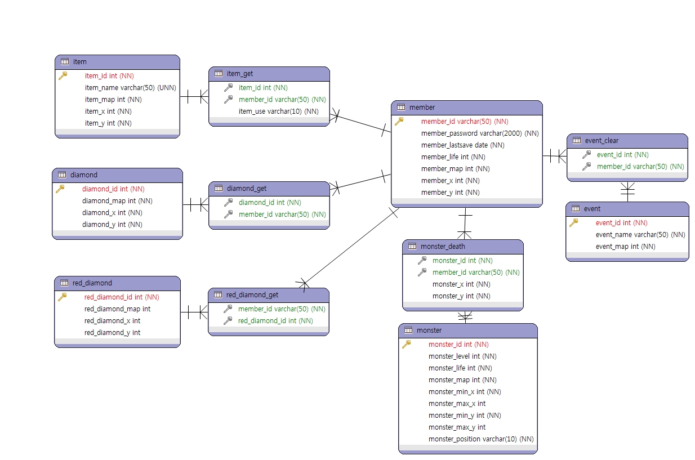

:skull: __옛날 코드 주의__  
# DungeonGame

2000년대 감성을 가진 던전 게임으로써 16개의 맵으로 이루어져 있습니다. 몬스터를 처치하고 보물을 모으면서 미로를 던전을 탈출 하는 고전 게임입니다.  
처음 개발공부를 시작할 때 바닐라 자비스크립트로 만들었던 게임을 후에
Spring 과 MySQL을 적용하여 업그레이드한 의미 있는 프로젝트 입니다.

## Stack

Language : Java , JavaScript, Html5, Css3, SQL  
Service System : Spring4, MyBatis, Apache Tomcat  
Database : MySQL8.0  
Tool : Eclipse, Workbench, ERMaster  
형상관리 : Git/GitHub  
배포 :Amazon Web Service(EC2, RDS, ROUTE53)  

## 결과화면

:movie_camera: **[시연영상 바로가기 클릭](https://www.youtube.com/watch?v=S76dEhq3IyE)**

## ERD

